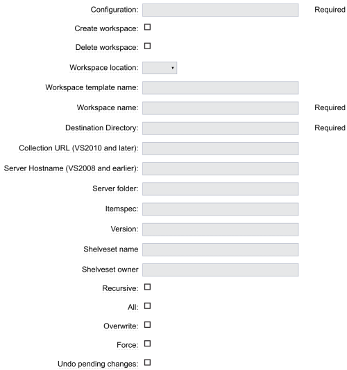
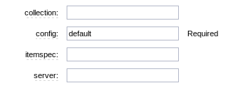
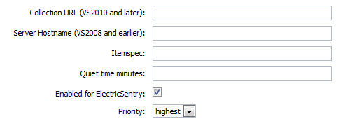

# Team Foundation Server plugin

Connect the MicroSoft Team Foundation Server (TFS) source control server to CloudBees CD/RO for code checkouts, preflight builds, and continuous integration. With this plugin, you can have different configurations, such as the preflight and sentry functions, that would be difficult to implement without it.

> **_IMPORTANT:_**  TFS must be installed and must be accessible from the command line. If you do not want to include TFS in the PATH variable, you must specify the TFS binary path.

# Integrated version

This plugin was developed and tested against MicroSoft Team Foundation
Server v2013.

# Plugin configuration

Plugin configurations are sets of parameters that apply across some or
all of the plugin procedures. They reduce repetition of common values,
create predefined sets of parameters for end users, and store
credentials securely. Each configuration has a unique name that is
automatically entered in designated parameters in the procedures.

## Configuration parameters

<table>
<colgroup>
<col style="width: 50%" />
<col style="width: 50%" />
</colgroup>
<thead>
<tr class="header">
<th style="text-align: left;">Parameter</th>
<th style="text-align: left;">Description</th>
</tr>
</thead>
<tbody>
<tr class="odd">
<td style="text-align: left;">
Configuration Name
</td>
<td style="text-align: left;">
The name of the SCM
configuration.
</td>
</tr>
<tr class="even">
<td style="text-align: left;">
Description
</td>
<td style="text-align: left;">
The description of the configuration.
CloudBees CD/RO does not use this information.
</td>
</tr>
<tr class="odd">
<td style="text-align: left;">
Login As
</td>
<td style="text-align: left;">
<em>Username</em>: The username that
CloudBees CD/RO uses to communicate with the TFS server.

<em>Password</em>: Provide the password for the
<em>Username</em>.

<em>Retype Password</em>: Re-enter the password.
</td>
</tr>
<tr class="even">
<td style="text-align: left;">
TFS binary path
</td>
<td style="text-align: left;">
Path to TFS binary when it is not
included in <code>$PATH</code> variable.
</td>
</tr>
</tbody>
</table>

## Output

The Source Control Configurations page now shows the new TFS
configuration.

# Plugin procedures

## CheckoutCode

This procedure downloads (checks out) a copy of the code from the TFS
server to the specified machine.

### Input

If you specify both the **Collection URL** and **Server Hostname**
parameters, a warning message appears, and the plugin tries to use the
**Server Hostname** parameter because it also works on MicroSoft Visual
Studio 2010.

If you do not specify values for these parameters, nothing is downloaded
to the specified machine, and an error message appears.

The procedure upon completion populates a property sheet called
`ecscm_changelogs`, which contains the changes included in this checkout
since the latest.

1.  Go to the **CheckoutCode** procedure.

2.  Enter the following parameters:

### Output

After the job runs, you can view the results on the **Job Details**
page. In the **CheckoutCode** step, select the **Log** icon for
diagnostic information.

## GetSCMTag

Use this procedure for Continuous Integration. It monitors the
repository to discover when something changes and to trigger a
preconfigured procedure.

### Input

1.  Go to the **getSCMTag** procedure.

2.  Enter the following parameters:

### Output

After the job runs, you can view the results on the **Job Details**
page. In the **getSCMTag** step, select the **Log** icon for diagnostic
information.

## Preflight (Agent Part)

The **Preflight** procedure runs the agent part of the preflight
workflow.

1.  Go to the **Preflight** procedure.

2.  Enter the following parameters:

### Output

After the job runs, you can view the results on the **Job Details**
page. In the **Preflight** step, select the **Log** icon for diagnostic
information.

## Preflight (Client Part)

This procedure runs the client part of the preflight workflow.

### Input

1.  Enter the following parameters:

### Output

See the client application for details.

## UpdateLastGoodAndLastCompleted

If the job outcome is successful, update the last successful snapshot
property to the revision used in the job.

### Input

1.  Go to the **updateLastGoodAndLastCompleted** procedure.

2.  Enter the following parameters:

### Output

After the job runs, you can view the results on the **Job Details**
page. In the **updateLastGoodAndLastCompleted** step, select the **Log**
icon for diagnostic information.

# Examples and use cases

## Configuring a sentry schedule form

In the project, select the **Schedules** tab, and then select the
**SCM** type in the pop-up.

1.  Select a step name.

2.  Then select the procedure that runs when the sentry is triggered.

3.  Enter the following information that is passed to the sentry
    monitor. In this example, the client is being monitored so that
    every time someone submits a changelist, the sentry triggers the
    runWithSentry procedure.

    

If something changes in the client, the sentry monitor shows a status.

The `runWithSentry` job now appears in the **Jobs** tab

# Release notes

## ECSCM-TFS 2.5.4

-   Migrated documentation to the main documentation site. (Deprecated)

## ECSCM-TFS 2.5.2

-   Renamed to "CloudBees".

## ECSCM-TFS 2.5.1

-   Updated plugin icon.

## ECSCM-TFS 2.5.0

-   Added **Run Schedule Even if Another Instance is Running** option
    for Sentry schedules.

## ECSCM-TFS 2.4.0

-   Added support to the **Checkout code** procedure to populate a
    property sheet called `ecscm_changelogs` that contains the changes
    included in a checkout since the latest.

## ECSCM-TFS 2.3.4

-   Added location and template options for workspace creation.

## ECSCM-TFS 2.3.3

-   Fixed errors under Windows OS.

## ECSCM-TFS 2.3.2

-   Fixed password escaping.

## ECSCM-TFS 2.3.1

-   Added **Overwrite** option for **Checkout** procedure.

## ECSCM-TFS 2.3.0 (August 13, 2015)

-   Added support for Linux TFS client.

-   Fixed job error when **undoPendingChanges** option is selected and
    no pending changes are present.

-   Added check to inspect if `itemSpec` is present when **Undo pending
    pages** selected.

## ECSCM-TFS 2.2.2 (February 10, 2015)

-   This plugin has been tested against Microsoft Team Foundation Server
    v2013.

## ECSCM-TFS 2.2.1

-   A `workflow` is not created if it already exists.

## ECSCM-TFS 2.2.0

-   Added the **Undo pending changes** parameter to the **CheckoutCode**
    procedure.

## ECSCM-TFS 2.1.0

-   Added the **Shelveset name** and **Shelveset owner** parameters to
    the **Checkout** procedure.

## ECSCM-TFS 2.0.1

-   Cleaned up the step picker name.

## ECSCM-TFS 2.0.0

-   Updated the Help page.

-   Added the step picker.

-   Added the XML panels.

-   Added the Help links.

## ECSCM-TFS 1.2.1

-   Added the parameter to set the TF binary path.

-   Fixed a bug in the Checkout procedure.

-   Updated the Help page.

## ECSCM-TFS 1.2.0

-   Fixed the preflight procedure.

## ECSCM-TFS 1.1.0

-   Fixed features.

-   Added the Sentry and Checkout features.

-   The Sentry procedure now works with different date formats.
